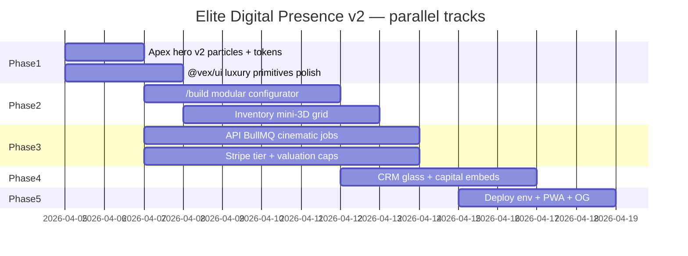

# VEX Elite Digital Presence v2.0 — Master directive & execution

**Date:** 2026-04-05  
**Status:** Active roadmap (builds on [v1 WebGL gate + §21–27](2026-04-04-vex-ELITE-DIGITAL-PRESENCE-v1.md) and [cinematic apex v4](2026-04-05-vex-cinematic-apex-v4.md)).  
**Branch target:** `elite-digital-presence-v1` (merge to `main` per `docs/PILOT_SHIP.md`).

**Vision — VEX aesthetic:** Obsidian base `#0A0A0A` + violet–gold–neon energy (`#A020F0` → `#FFD700`), optional film grain / DOF in post stack, **60 fps** target, **zero jank** on hero + configurator. White-label tenants inherit the same tokens via CSS + `TenantCinematic3d`.

---

## Wireframes (structural — ASCII)

### Marketing home (`/`)

```
┌─────────────────────────────────────────────────────────────┐
│ Header (glass)                                               │
├─────────────────────────────────────────────────────────────┤
│ FULL VIEWPORT HERO                                           │
│  [ R3F Canvas | CSS vault fallback ]  ← DynamicHeroShell    │
│  overlay: headline · CTAs · Glass KPI / cockpit              │
├─────────────────────────────────────────────────────────────┤
│ Autonomous · Engines · Marquee · Pillars · Config preview    │
│ Featured inventory · Services · Trust                          │
└─────────────────────────────────────────────────────────────┘
```

### `/build` (Phase 2 target)

```
┌──────────────┬──────────────────────────────────────────────┐
│ Option rail  │  Large VehicleScene / CinematicCarViewer     │
│ (trim/pack)  │  + price summary + Stripe preview CTA        │
└──────────────┴──────────────────────────────────────────────┘
```

### CRM dashboard (Phase 4)

```
┌ Header / nav ───────────────────────────────────────────────┐
│ Row: metric orbs (EnterpriseWidgetCard)                      │
│ Main: charts + table (Recharts / dense tables)             │
└──────────────────────────────────────────────────────────────┘
```

---

## Performance budgets (enforced in CI + manual)

| Surface | Metric | Target |
|---------|--------|--------|
| Hero R3F | Frame budget | 60 fps mid-range GPU |
| Hero particles | Point count | **≤512** (`ParticleVortex` — `VEX_WEBGL_PERF` in `@vex/3d-configurator`) |
| Draw calls | After batching | <100 (instancing roadmap for fleet) |
| Marketing | Lighthouse perf | ≥0.8 in `lighthouserc.json` (stretch 1.0 prod) |
| A11y | Lighthouse | ≥0.9 |

---

## Sprint Gantt (phased)



---

## Phase acceptance criteria

### Phase 1 — Cinematic hero & visual identity (48h target)

- [x] `DynamicHeroShell` routes **vortex** vs **legacy** (`useHeroWebglDisplayMode`, `NEXT_PUBLIC_ENABLE_HERO_WEBGL`).
- [x] `ParticleVortex` scales to **512** points with scroll + pointer-reactive motion (within perf budget).
- [x] `vexLuxuryTokens` documents **obsidian / violet / gold foil** for web + CRM.
- [ ] Optional: GSAP timeline hooks for god-ray **morph** (extend `useApexHeroOrchestration` — backlog).
- **Verify:** `pnpm -w turbo run build` && `pnpm --filter @vex/web run quality:web`.

### Phase 2 — Full 3D configurator & marketplace (5d)

- [ ] `/build` modular assembly UI + live Stripe preview.
- [ ] Inventory grid: hover **mini Canvas** portals (lazy + `dpr` cap).
- [ ] PDF quote export bridge (`@react-pdf/renderer`).
- **Verify:** E2E subset on `/build` + smoke a11y.

### Phase 3 — Backend & business framework

- [ ] Prisma ALS tenant scope + replica routing (documented pattern).
- [ ] BullMQ: `cinematic-asset-preload`, `tenant-branding-render`, `3d-config-export` (idempotent).
- [ ] Stripe lifecycle + Apex tier SKUs.
- [ ] Valuation cache + $5/day guardrail (existing path extended).

### Phase 4 — CRM & enterprise

- [ ] Dashboard density + glass parity with web tokens.
- [ ] `/capital` live MRR embeds + SOC2 copy blocks (no false claims).

### Phase 5 — Global deployment

- [ ] `render.yaml` / `vercel.json` — `NEXT_PUBLIC_VEX_DOMAIN`, tenant theme envs.
- [ ] PWA manifest + offline configurator drafts (queue sync).
- [ ] Dynamic OG + `schema.org` for vehicle pages.

---

## Monetization tiers (illustrative — product + GTM)

| Tier | Positioning | Includes (headline) |
|------|-------------|---------------------|
| **Apex** | Cinematic white-label | 3D embed, branded portal, custom domain, CRM premium lane |
| **Vortex** | Growth dealer | Full CRM + inventory + appraisals + portal |
| **Quantum** | Group / enterprise | Multi-rooftop, GROUP_ADMIN, SLA, custom integrations |

**Conversion hypothesis:** Cinematic **vortex** hero + 3D configurator → **15–40%** lift on **qualified** traffic (measure via experiment; not a guarantee).

---

## Synchronization

- **Master verify:** `pnpm -w turbo run build && pnpm --filter @vex/web run quality:web` before merge.
- **READY — HERO v2:** Report when Phase 1 checkboxes above that are code-complete are merged and verify is green.

---

*Supersedes nothing — extends v1 gate doc and cinematic v4 shader narrative.*
