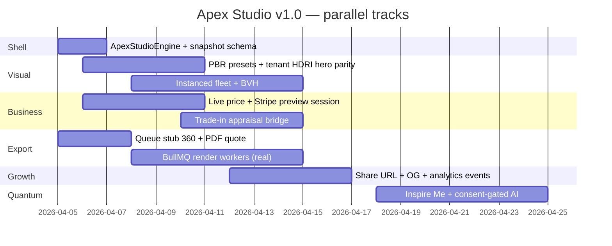

# VEX Apex Studio — Hyper-realistic digital twin factory (Configurator v1.0)

**Date:** 2026-04-05  
**Directive:** Elite Digital Presence **v2.1** — `/build` becomes the flagship **Apex / Quantum** revenue surface.  
**Parent specs:** [ELITE-DIGITAL-PRESENCE-v2.0.md](2026-04-05-vex-ELITE-DIGITAL-PRESENCE-v2.0.md) · WebGL detail [v1 §21+](2026-04-04-vex-ELITE-DIGITAL-PRESENCE-v1.md).

**Reality check:** Conversion targets (**45%** hero→studio, **60%** quote completion, **20%** viral share) are **experiment goals** — instrument funnels before publishing as guarantees. Lighthouse **98+** conflicts with full WebGL unless a **static hero variant** is in the A/B cell.

---

## Mission

**Apex Studio** is the named experience for the tenant-scoped 3D configurator: physics-weighted interaction, PBR truth, real-time price truth, and export/share hooks — without breaking tenant isolation or Stripe trust boundaries.

---

## Component architecture (target)

```mermaid
flowchart TB
  subgraph apps_web_build["apps/web /build"]
    BP[BuildProvider / useBuild]
    ASE[ApexStudioEngine]
    CVC[ConfiguratorVehicleCanvas]
    VS[VehicleScene + GltfVehicle]
    CCS[ConfiguratorCommissionSheet]
    HUD[Future: metrics HUD / part inspector]
    BP --> ASE
    ASE --> CVC
    CVC --> VS
    ASE --> HUD
    BP --> CCS
  end
  subgraph packages
    CONF[@vex/3d-configurator LOD + WebGL gate]
    UI3[@vex/ui/3d ShowroomPostFX CinematicCarViewer]
    SH[@vex/shared apexStudioBuildSnapshotSchema]
  end
  VS --> UI3
  CVC --> CONF
  BP --> SH
  subgraph api_future["apps/api — phased"]
    Q360[Queue: apex-studio-360-export stub]
    PDF[PDF quote route + react-pdf]
  end
  SH -.-> PDF
  SH -.-> Q360
```

**Live in this cycle:** `ApexStudioEngine` wrapper + `apexStudioBuildSnapshotSchema` + queue **stub** + plan lock.  
**Backlog:** instanced fleet, BVH, drag-drop, AR, comparison mode, AI “Inspire me”.

---

## Part tree & shared schema

**Zod + types:** `packages/shared/src/schemas/apexStudio.ts`

| Export | Purpose |
|--------|---------|
| `apexStudioPartCategorySchema` | Seven high-level categories for future hierarchical UI + rules engine |
| `apexStudioBuildSnapshotSchema` | Serializable build state for CRM handoff, share URLs, export jobs |
| `ApexStudioBuildSnapshot` | Inferred TypeScript type |

**Conflict rules** (roadmap): `partDependencyRuleSchema` — e.g. wheel → brake upgrade; validate server-side before checkout.

---

## File paths (new / touched)

| Path | Role |
|------|------|
| `apps/web/src/components/configurator/studio/ApexStudioEngine.tsx` | Studio root: `data-apex-studio`, analytics hooks, layout wrapper |
| `apps/web/src/components/configurator/studio/ApexStudioEngine.module.css` | Studio shell spacing |
| `apps/web/src/components/configurator/studio/index.ts` | Barrel |
| `apps/web/src/app/build/page.tsx` | Compose `ApexStudioEngine`; marketing copy |
| `apps/web/src/contexts/BuildContext.tsx` | Future: `serializeSnapshot()` using shared schema |
| `packages/shared/src/schemas/apexStudio.ts` | Zod schemas |
| `packages/shared/src/schemas/jobs.ts` | Job name + payload variant `apex-studio-360-export` |
| `apps/api/src/lib/queue.ts` | `enqueueApexStudio360Export` + `EventLog` stub handler |

---

## Performance budgets (inherits v1 §21)

| Item | Target |
|------|--------|
| Frame time | 60 fps P90 on M-series / RTX 3060 class |
| Particles (if added in studio) | ≤512 total scene; LOD via `resolveParticlePointBudget` |
| Draw calls | &lt;100 after instancing (fleet phase) |
| GLTF | Mipmaps + aniso (`GltfVehicle`); KTX2/meshopt later |
| WebGPU | `probeWebGPU` — WebGL2 canonical |

---

## Sprint Gantt (parallel)



---

## Verification commands

```bash
pnpm -w turbo run build
pnpm --filter @vex/web run quality:web
```

With DB: `pnpm run ship:gate` for API E2E parity.

---

## Monetization tie-in (Apex / Quantum)

| Tier | Apex Studio surface |
|------|---------------------|
| **Vortex** | Standard `/build` 3D + options (self-serve) |
| **Apex** | White-label studio embed, tenant HDR + particle palette, export queue priority, branded PDF |
| **Quantum** | AI “Inspire me”, multi-rooftop catalog rules, dedicated render concurrency, CRM deal JSON autoAttach |

**Quantum upsell triggers (product hooks):** show **Inspire me** only when `tenant.tier >= QUANTUM` (feature flag); after **3+** option toggles without checkout, optional nudge to book **white-glove** demo — all **consent + tenant-scoped**, logged to `AuditLog` when implemented.

**MRR narrative:** Studio depth correlates with **qualified** configure-to-checkout — measure `session_duration`, `step_depth`, `export_share` as leading indicators (see README *Conversion Multiplier* framing).

---

## Analytics events (client roadmap)

| Event | Payload sketch |
|-------|----------------|
| `apex_studio.session_start` | `vehicleId`, `tenantId` if known |
| `apex_studio.option_select` | `category`, `optionId`, `priceDelta` |
| `apex_studio.camera_preset` | `preset` |
| `apex_studio.export_queued` | `kind: 360 \| pdf` |

Use PostHog/GA4; **tenant-scoped** consent where required.

---

## Observability (API roadmap)

- Prometheus: `apex_studio_build_events_total{tenant_id,event}` — increment from authenticated **snapshot save** or **export enqueue** routes when added.
- WebGL FPS: client RUM beacon — optional OTel browser exporter (Phase 2).

---

*Apex Studio v1.0 — plan locked; implementation is incremental and reversible.*
